# Generative Art

Just art, because art.

## Samples

### Series: Ukraine

#### Outputs  (without Initialization Image)

Let this series run at high quality settings, some of them haven't reached the prescribed steps.

---
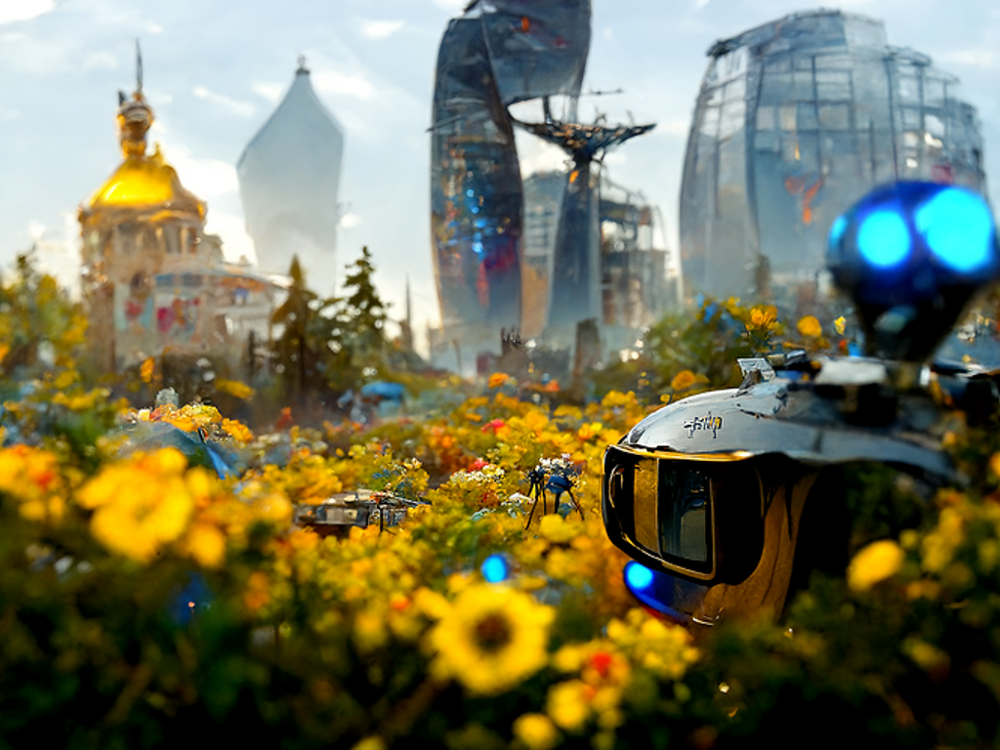

---
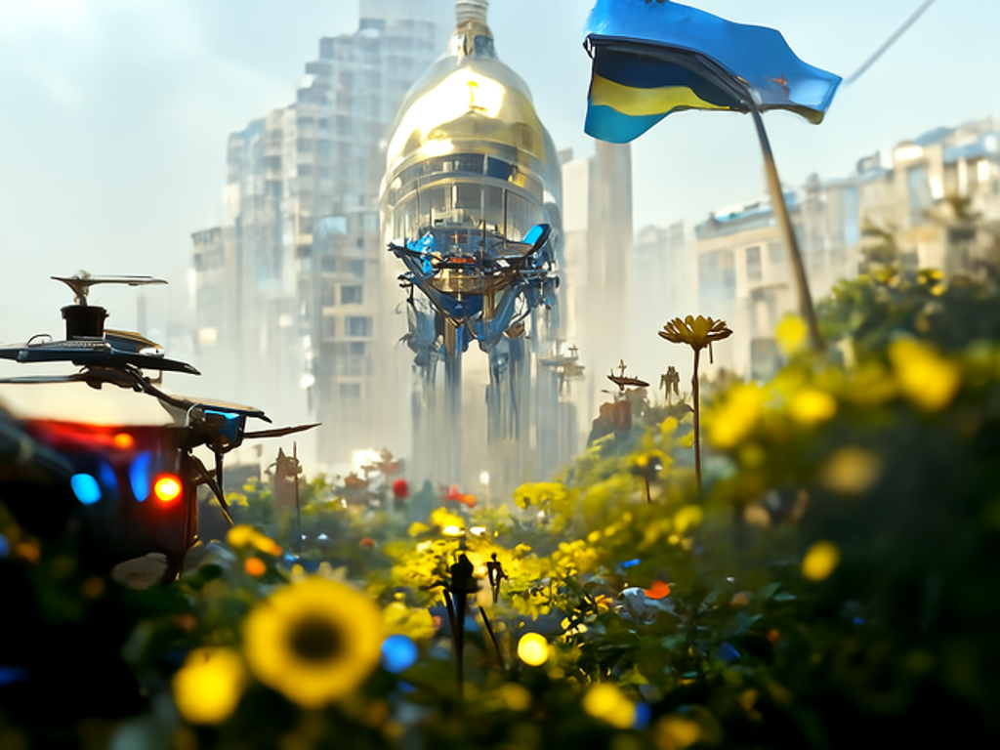

---
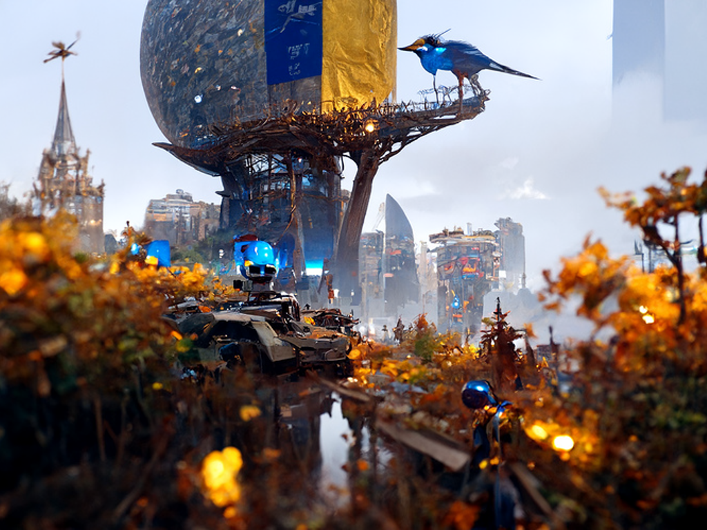

---

### Series: Cyborg: Futuristic City

#### Initialization Image

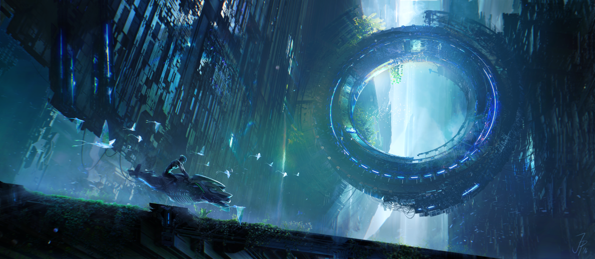

#### Outputs (with Initialization Image)

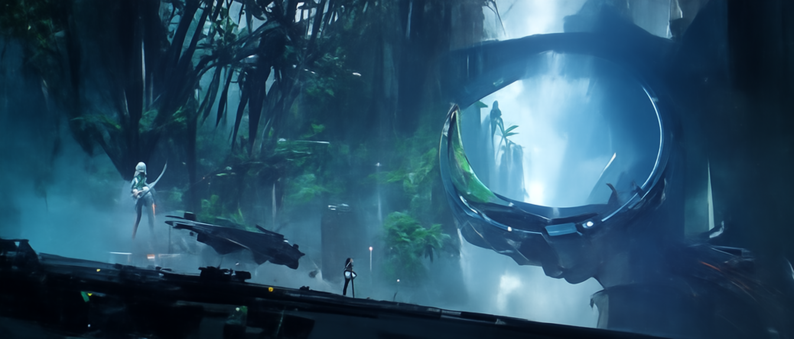

---

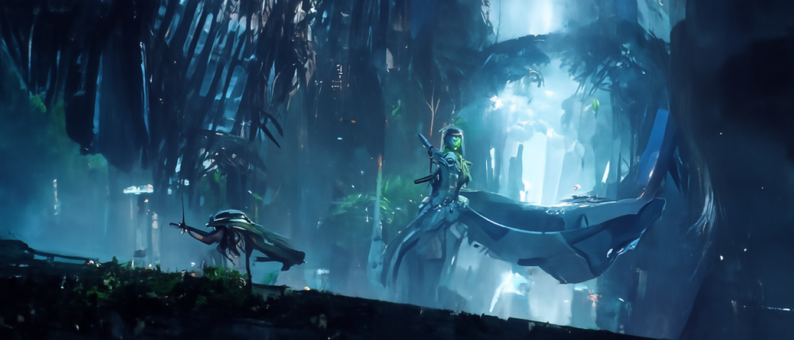

---
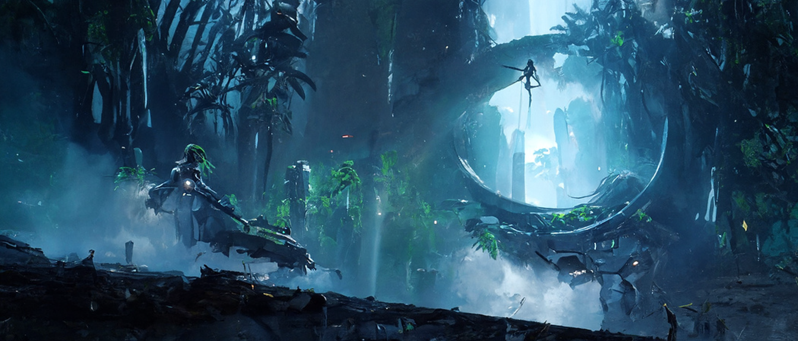

---
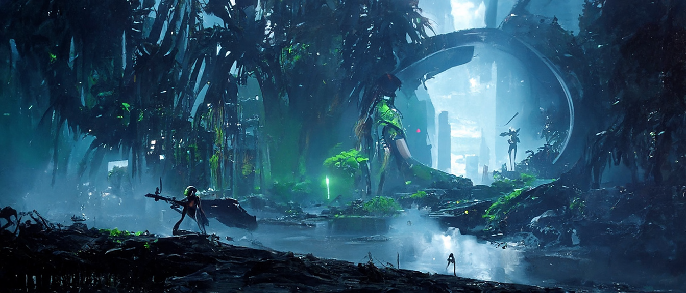

---
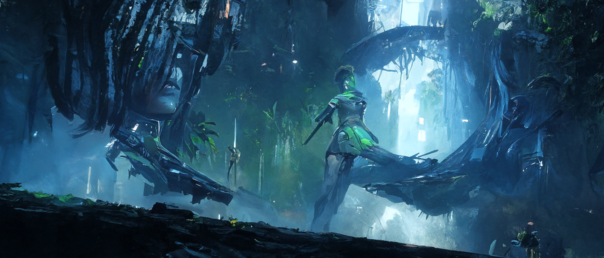

---

#### Outputs (without Initialization Image)

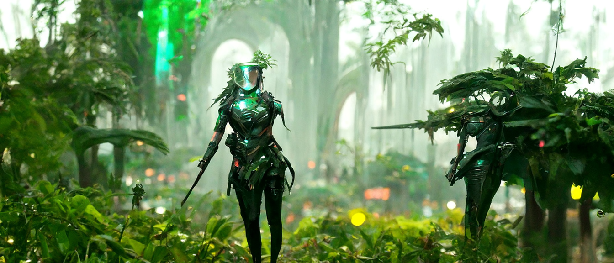
---
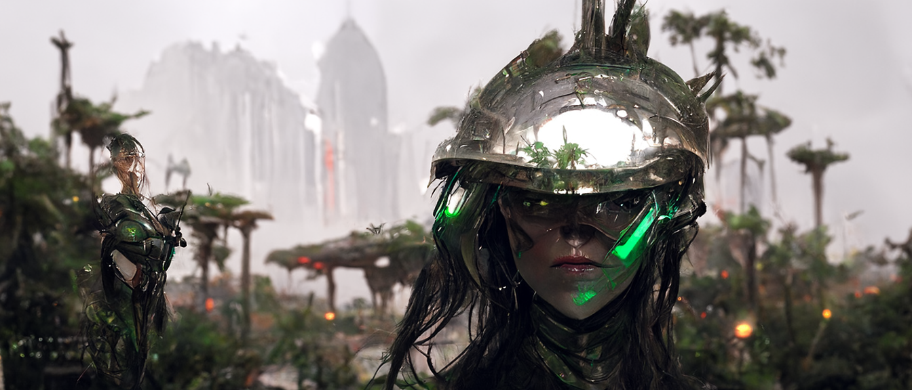
---
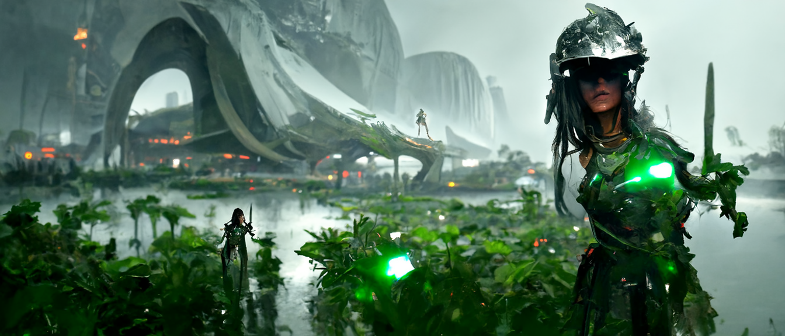
---

Notice the skewed nose in this one.

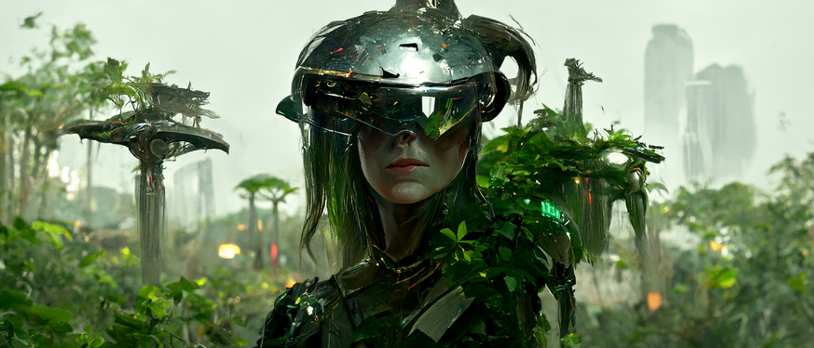
---

### Series: Asteroid

#### Initialization Image

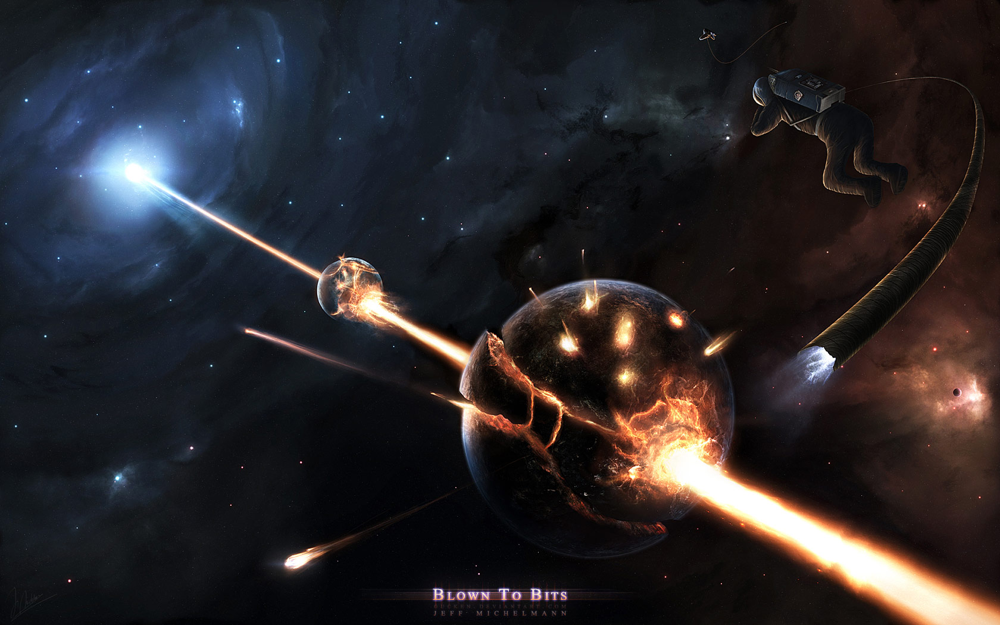

#### Outputs  (with Initialization Image)

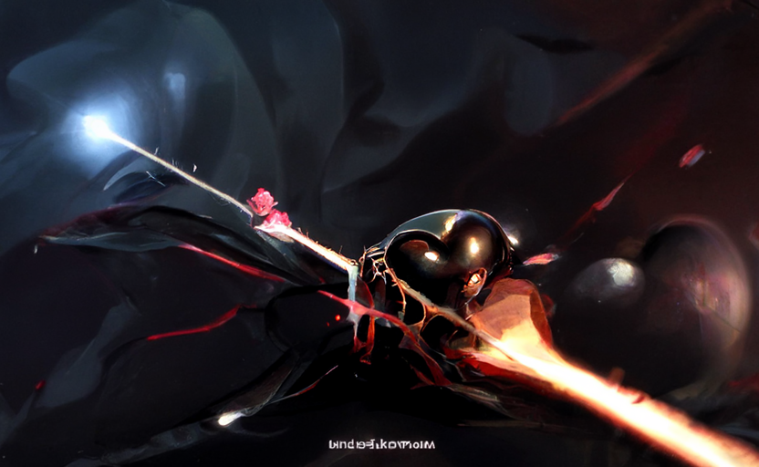

---

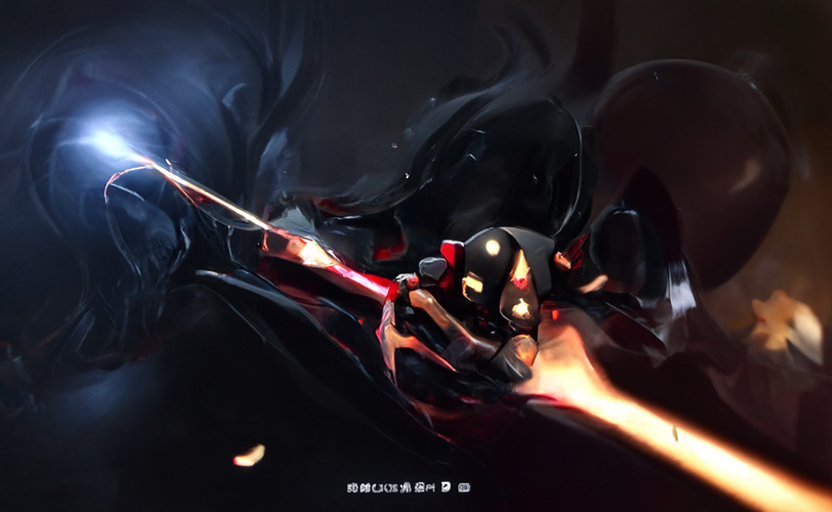

---

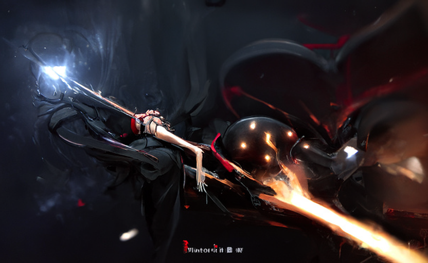

---

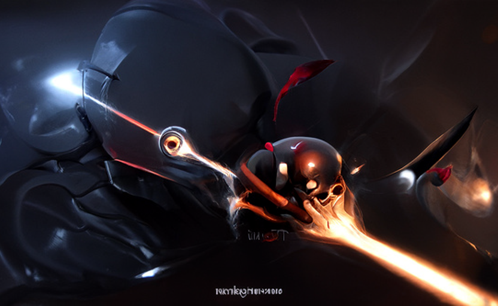

---

Stay tuned for the full series.

## Related Work
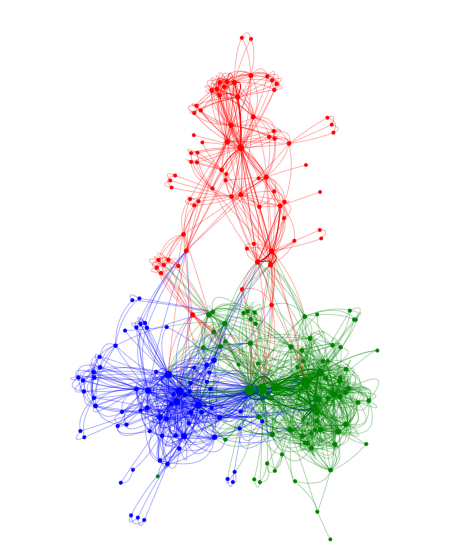

## Concepts

-   [ ] [Diffusion Models Beat GANs on Image Synthesis](https://arxiv.org/abs/2105.05233)
-   [ ] [Self Supervised Learning, Conditional vs Unconditional GANs](https://towardsdatascience.com/self-supervised-gans-2aec1eadaccd)

## Inspiration Fodder

-   [Quick-Eyed Sky](https://www.youtube.com/channel/UCkYi6dzJ5emaY0tPGat3k9Q)

-   [ArtificialImages](https://www.youtube.com/c/ArtificialImages)