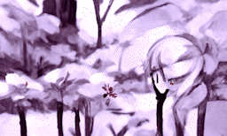

# Generative Art

Just art, because art.

---

---

---

## Concepts

-   [ ] Diffusion Models
-   [ ] [Diffusion Models Beat GANs on Image Synthesis](https://arxiv.org/abs/2105.05233)
-   [ ] [Self Supervised Learning, Conditional vs Unconditional GANs](https://towardsdatascience.com/self-supervised-gans-2aec1eadaccd)
