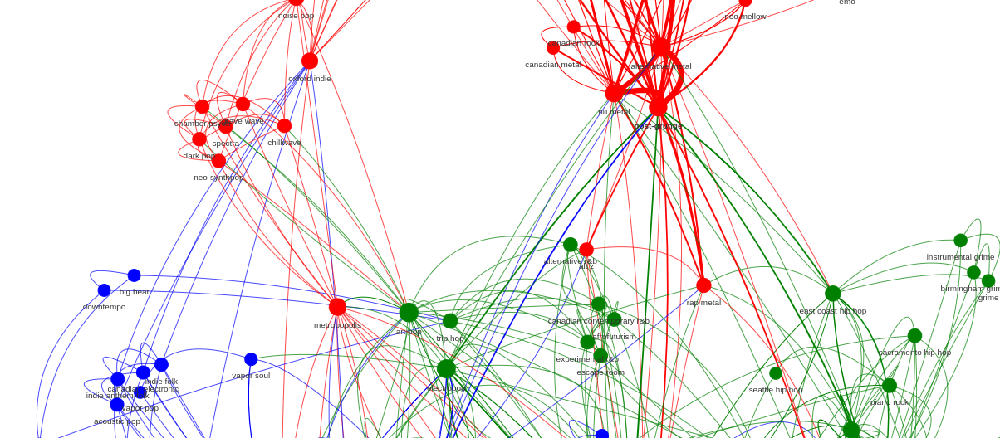
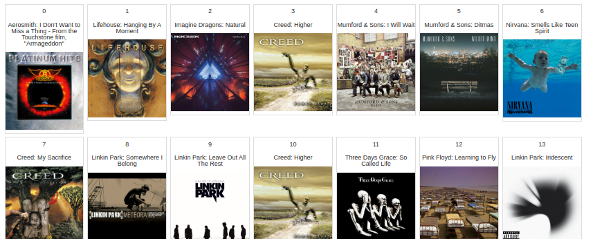

# Spotify API

Explore my musical genres and deeper preferences using the Spotify API. 
Your credentials should be in a `.env` file with these variables for the file to work:

```bash
SPOTIFY_CLIENT_ID=<YOUR_SPOTIFY_CLIENT_ID>
SPOTIFY_CLIENT_SECRET=<YOUR_SPOTIFY_CLIENT_SECRET>
SPOTIFY_PLAYLIST_IDS=<YOUR_SPOTIFY_CLIENT_PLAYLIST_IDS_COMMA_DELIMITED>
```

```bash
python3 -m venv .venv
source .venv/bin/activate
pip3 install -r requirements.txt
python3 main.py
```


## Results





###  Clusters

#### Audio Features: Tracks: Artists
| 0                           | 1             | 2                       | 3              |     |     |     |     |     |     |
| --------------------------- | ------------- | ----------------------- | -------------- | --- | --- | --- | --- | --- | --- |
| poison                      | fleetwood mac | five finger death punch | creed          |     |     |     |     |     |     |
| radiohead                   |               | metallica               | mumford & sons |     |     |     |     |     |     |
| joan jett & the blackhearts |               | fleetwood mac           | linkin park    |     |     |     |     |     |     |
| guns n roses                |               |                         |                |     |     |     |     |     |     |
| dire straits                |               |                         |                |     |     |     |     |     |     |
| red hot chili peppers       |               |                         |                |     |     |     |     |     |     |
| ac/dc                       |               |                         |                |     |     |     |     |     |     |
| linkin park                 |               |                         |                |     |     |     |     |     |     |
| pink floyd                  |               |                         |                |     |     |     |     |     |     |

#### Audio Features: Tracks: Genres

| 0                | 1          | 2                 | 3                 |     |     |     |     |     |     |
| ---------------- | ---------- | ----------------- | ----------------- | --- | --- | --- | --- | --- | --- |
| funk metal       | yacht rock | old school thrash | post-grunge       |     |     |     |     |     |     |
| glam metal       | soft rock  | thrash metal      | nu metal          |     |     |     |     |     |     |
| art rock         |            | metal             | alternative metal |     |     |     |     |     |     |
| funk rock        |            | yacht rock        | pop rock          |     |     |     |     |     |     |
| modern rock      |            | classic rock      | permanent wave    |     |     |     |     |     |     |
| mellow gold      |            | alternative metal |                   |     |     |     |     |     |     |
| hard rock        |            | hard rock         |                   |     |     |     |     |     |     |
| permanent wave   |            | nu metal          |                   |     |     |     |     |     |     |
| alternative rock |            |                   |                   |     |     |     |     |     |     |


Example:
Top 10 sub-genres in my rock playlist:


```sql
index  genres
0               rock      52
1  alternative metal      26
2        post-grunge      22
3           nu metal      19
4       classic rock      18
5         album rock      17
6           pop rock      15
7          hard rock      15
8   alternative rock      11
9        modern rock      11
```

Top 10 sub-genres in my electronic playlist:


```sql
index  genres
0                edm      28
1          pop dance      26
2     tropical house      24
3          dance pop      15
4  progressive house      14
5                pop      13
6              house      11
7            pop edm      11
8      electro house      10
9             trance       8

```